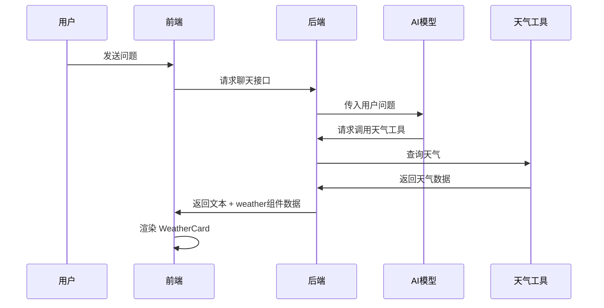

像我这样的 AI 聊天工具，本质上不是“模型直接渲染组件”，而是：

> **模型输出结构化内容或特殊指令 → 前端识别 → 前端组件系统渲染成 UI**

可以把它理解成一个“聊天消息渲染管线”。

---

## 1. 最基础：Markdown 渲染

AI 最常见的输出是 Markdown，例如：

```md
## 标题

这是正文。

- 列表 1
- 列表 2

```python
print("hello")
```
```

前端收到后，会用 Markdown 解析器把它转换成 HTML/React 组件：

```tsx
<ReactMarkdown>{message.content}</ReactMarkdown>
```

最终渲染成：

```html
<h2>标题</h2>
<p>这是正文。</p>
<ul>
  <li>列表 1</li>
  <li>列表 2</li>
</ul>
<pre><code>print("hello")</code></pre>
```

常用库有：

```bash
react-markdown
remark-gfm
rehype-highlight
rehype-katex
```

它们可以支持：

- 标题
- 表格
- 代码块
- 数学公式
- 链接
- 引用
- 列表

---

## 2. 代码块：单独组件渲染

比如 AI 输出：

````md
```python
def hello():
    print("Hello")
```
````

前端通常不会直接显示纯文本，而是会识别代码块，然后渲染成专门的 `CodeBlock` 组件：

```tsx
function CodeBlock({ language, code }) {
  return (
    <div className="code-block">
      <div className="code-header">
        <span>{language}</span>
        <button>复制</button>
      </div>
      <pre>
        <code>{code}</code>
      </pre>
    </div>
  );
}
```

所以你看到的“代码块 + 复制按钮 + 语法高亮”，其实不是模型直接画出来的，而是前端组件包装后的结果。

---

## 3. 表格、数学公式、引用等组件

例如模型输出 Markdown 表格：

```md
| 名称 | 作用 |
|---|---|
| React | 前端框架 |
| Markdown | 文本格式 |
```

前端解析后渲染为 `<table>`。

数学公式通常用 KaTeX 或 MathJax：

```md
$$
E = mc^2
$$
```

前端识别公式块后，用公式渲染组件显示。

---

## 4. 更高级：结构化组件渲染

很多 AI 聊天工具不只支持 Markdown，还支持“结构化消息”。

例如后端返回的不是单纯文本，而是：

```json
{
  "type": "weather",
  "data": {
    "city": "New York",
    "temperature": 24,
    "condition": "Cloudy"
  }
}
```

前端根据 `type` 决定渲染哪个组件：

```tsx
switch (message.type) {
  case "text":
    return <MarkdownMessage content={message.content} />;

  case "weather":
    return <WeatherCard data={message.data} />;

  case "chart":
    return <ChartCard data={message.data} />;

  case "file":
    return <FilePreview data={message.data} />;

  default:
    return <MarkdownMessage content={message.content} />;
}
```

这就是很多 AI 工具里天气卡片、图表、地图、文件预览等 UI 的来源。

---

## 5. 工具调用组件：AI 不只是回复文本

更复杂的系统会让模型调用工具。

例如用户问：

> 今天纽约天气怎么样？

流程可能是：



后端可能返回：

```json
{
  "messages": [
    {
      "role": "assistant",
      "type": "text",
      "content": "纽约今天多云，气温约 24°C。"
    },
    {
      "role": "assistant",
      "type": "component",
      "component": "weather_card",
      "props": {
        "city": "New York",
        "temp": 24,
        "condition": "Cloudy"
      }
    }
  ]
}
```

前端再根据 `component` 渲染对应组件。

---

## 6. 流式输出时怎么渲染？

AI 聊天工具通常是边生成边显示。

后端会用：

- SSE：Server-Sent Events
- WebSocket
- HTTP Streaming

不断把 token 发给前端。

例如：

```text
data: 你好
data: ，
data: 我
data: 可以
data: 帮你
data: ...
```

前端维护一个消息状态：

```tsx
setMessages(prev => {
  const last = prev[prev.length - 1];

  return [
    ...prev.slice(0, -1),
    {
      ...last,
      content: last.content + newToken
    }
  ];
});
```

所以你看到 AI 回复是“一个字一个字冒出来”的。

---

## 7. 流式 Markdown 的难点

流式渲染 Markdown 有一个问题：

模型还没输出完，Markdown 结构可能是不完整的。

比如正在输出：

````md
```python
print("hello")
````

代码块结束符还没到，前端不知道它是不是完整代码块。

常见处理方式有两种：

### 方式一：实时 Markdown 渲染

每次 token 更新后都重新解析整个 Markdown。

优点：简单。

缺点：长文本时性能差，且未闭合代码块可能显示异常。

### 方式二：分块渲染

把消息拆成多个 block：

```ts
type MessageBlock =
  | { type: "paragraph"; content: string }
  | { type: "code"; language: string; content: string }
  | { type: "table"; content: string }
  | { type: "component"; name: string; props: any };
```

这样前端可以更稳定地渲染不同块。

---

## 8. 文件、图片、PDF 是怎么显示的？

文件上传后，一般会生成一个附件对象：

```json
{
  "type": "attachment",
  "fileName": "report.pdf",
  "mimeType": "application/pdf",
  "url": "/uploads/report.pdf",
  "size": 1024000
}
```

前端渲染成文件卡片：

```tsx
<FileCard
  name="report.pdf"
  type="PDF"
  size="1MB"
  url="/uploads/report.pdf"
/>
```

如果是图片，就显示：

```tsx

```

如果是 PDF，可能用：

```tsx
<iframe src={url} />
```

或者用 `pdf.js` 自定义渲染。

---

## 9. 图表是怎么渲染的？

AI 不一定直接生成图片，而是生成图表数据。

例如：

```json
{
  "type": "chart",
  "chartType": "line",
  "data": [
    { "x": "Mon", "y": 12 },
    { "x": "Tue", "y": 18 },
    { "x": "Wed", "y": 9 }
  ]
}
```

前端用图表库渲染：

```tsx
<LineChart data={data}>
  <XAxis dataKey="x" />
  <YAxis />
  <Line dataKey="y" />
</LineChart>
```

常用库：

```text
ECharts
Recharts
Chart.js
Plotly
AntV
```

---

## 10. 类似 ChatGPT 的组件系统可以怎么设计？

对于你的 AnotherMe 项目，可以这样设计消息结构：

```ts
type ChatMessage = {
  id: string;
  role: "user" | "assistant" | "system";
  blocks: MessageBlock[];
};

type MessageBlock =
  | {
      type: "markdown";
      content: string;
    }
  | {
      type: "code";
      language: string;
      content: string;
    }
  | {
      type: "image";
      url: string;
      alt?: string;
    }
  | {
      type: "file";
      fileName: string;
      mimeType: string;
      url: string;
    }
  | {
      type: "quiz";
      question: string;
      options: string[];
      answer?: string;
    }
  | {
      type: "knowledge_card";
      title: string;
      points: string[];
    }
  | {
      type: "learning_state";
      mastered: string[];
      weak: string[];
      nextSuggestion: string;
    };
```

然后前端渲染：

```tsx
function MessageRenderer({ message }: { message: ChatMessage }) {
  return (
    <div className={`message ${message.role}`}>
      {message.blocks.map((block, index) => (
        <BlockRenderer key={index} block={block} />
      ))}
    </div>
  );
}
```

```tsx
function BlockRenderer({ block }: { block: MessageBlock }) {
  switch (block.type) {
    case "markdown":
      return <MarkdownMessage content={block.content} />;

    case "code":
      return <CodeBlock language={block.language} code={block.content} />;

    case "image":
      return ;

    case "file":
      return <FileCard file={block} />;

    case "quiz":
      return <QuizCard data={block} />;

    case "knowledge_card":
      return <KnowledgeCard data={block} />;

    case "learning_state":
      return <LearningStateCard data={block} />;

    default:
      return null;
  }
}
```

---

## 11. 对教学 AI 来说，建议支持哪些组件？

你的项目是教学方向，我建议不要只做普通 Markdown，可以设计一些教学专用组件：

| 组件 | 用途 |
|---|---|
| `MarkdownMessage` | 普通讲解 |
| `CodeBlock` | 代码展示、复制、运行 |
| `FormulaBlock` | 数学公式 |
| `StepCard` | 分步骤解题 |
| `HintCard` | 苏格拉底式提示 |
| `QuizCard` | 选择题、判断题、小测 |
| `KnowledgeCard` | 知识点卡片 |
| `MistakeCard` | 错因分析 |
| `LearningStateCard` | 当前掌握情况 |
| `FileCard` | 用户上传文件展示 |
| `ImagePreview` | 图片题目、截图 |
| `ProgressPanel` | 学习进度 |
| `ConceptGraph` | 知识图谱 |

例如 AI 后端返回：

```json
{
  "role": "assistant",
  "blocks": [
    {
      "type": "markdown",
      "content": "我们先不要直接给答案，先看第一步。"
    },
    {
      "type": "hint",
      "level": 1,
      "content": "你觉得这个题目中已知条件和要求分别是什么？"
    },
    {
      "type": "quiz",
      "question": "这里应该优先使用哪种方法？",
      "options": ["枚举", "动态规划", "贪心", "二分"],
      "answer": "动态规划"
    }
  ]
}
```

前端就可以渲染成“讲解 + 提示卡 + 互动题”。

---

## 12. 总结架构

整体可以这样设计：

```text
用户输入
  ↓
前端 ChatInput
  ↓
后端 Chat API
  ↓
LLM 生成回复 / 调用工具
  ↓
后端整理为统一消息格式
  ↓
返回：
  - Markdown 文本
  - 结构化 blocks
  - 工具结果
  - 附件信息
  ↓
前端 MessageRenderer
  ↓
根据 block.type 渲染不同组件
```

核心思想是：

> **不要让模型直接决定 UI 长什么样，而是让模型输出受控的数据结构，前端用固定组件库渲染。**

这样更稳定、更安全，也更适合你的 AnotherMe 教学系统。
